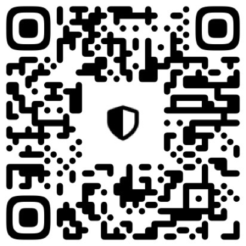
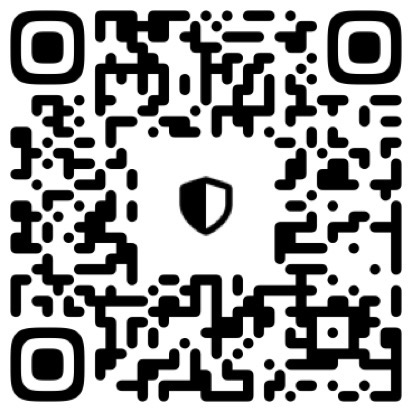
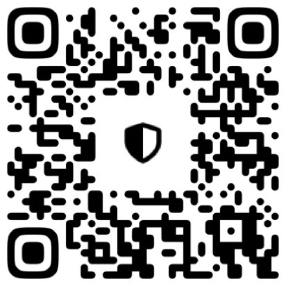
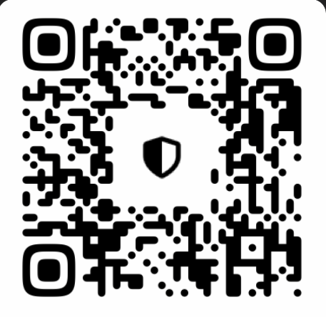
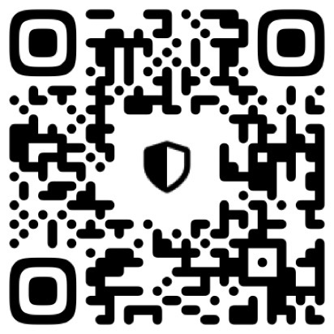
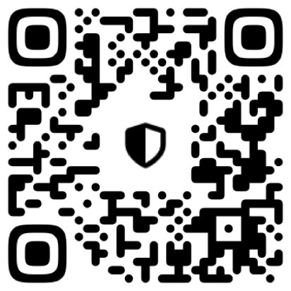
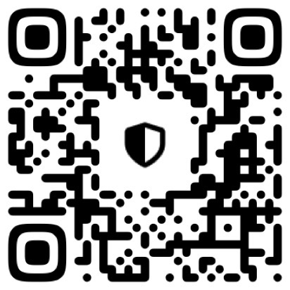
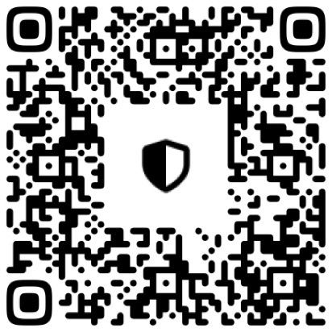

# BTC:
Address: `bc1qjfpmgj5n9s6cn6mjze7em7vs42fvx4kufc8nuk`

Scan it with your crypto wallet:

# ETH:
Address: `0xB88c0dfAd5981bfa5e613496089EB51A94000F9C`

Scan it with your crypto wallet:

# SOL:
Address:  `FF2K6d2a3sxMtc8LUEghF27DXNQAURMXXf3ccvjkUgUk`

Scan it with your crypto wallet:

# XMR (Monero):
Scan it with your crypto wallet:

# BNB:
Address:  `0xB88c0dfAd5981bfa5e613496089EB51A94000F9C`

Scan it with your crypto wallet:

# USDC (ERC20):
Address:  `0xB88c0dfAd5981bfa5e613496089EB51A94000F9C`

Scan it with your crypto wallet:

# XRP:
Address:  `rNdrwQa3eFeN3koN1B434h5gAWi89uzXpA`

Scan it with your crypto wallet:

# TRX:
Address:  `TU7tzZMPcJyhwrQMwXgXZp6sxQArbotHbe`

Scan it with your crypto wallet:

# DOGE:
Address:  `DJmq174FTQEFuRLcqm44Lpk1PeoomfukyR`

Scan it with your crypto wallet:

# SUI:
Address:  `0x703088fe89263c2bd382d628432f30273e94e2d7a417abe2762d87043c95040b`

Scan it with your crypto wallet:

