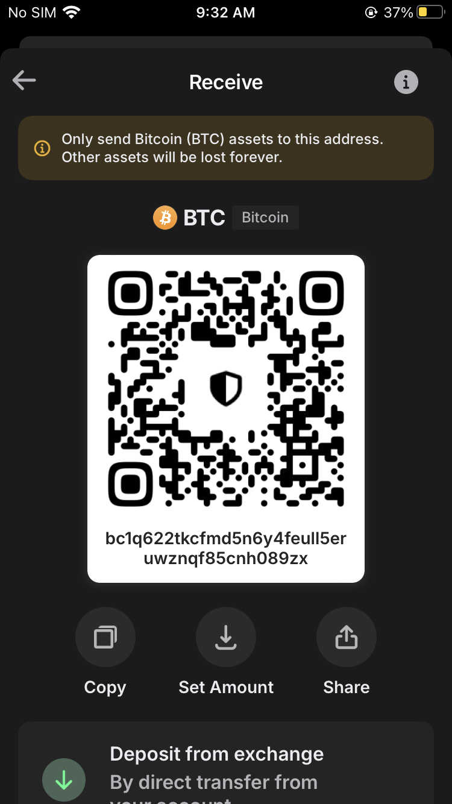
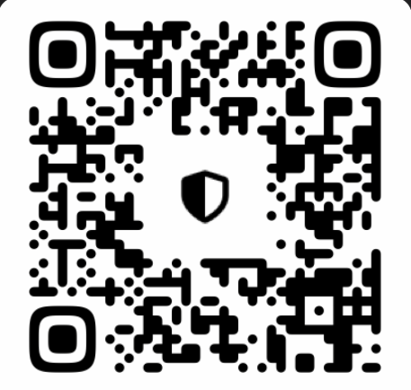
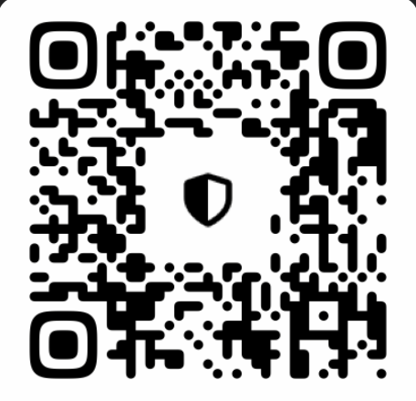

# BTC:
Address: `bc1q622tkcfmd5n6y4feull5eruwznqf85cnh089zx`

Scan it with your crypto wallet:

# ETH:
Address: `0x48ff8B662d34778c55270ec38861064d229413c2`

Scan it with your crypto wallet:

# SOL:
Address:  `HT1wi9WQZ366Z1cA7hFtHS6gvcqUbFDaJHUeqfodjNNm`

Scan it with your crypto wallet:

# XMR (Monero):
Address: `HT1wi9WQZ366Z1cA7hFtHS6gvcqUbFDaJHUeqfodjNNm`

Scan it with your crypto wallet:

